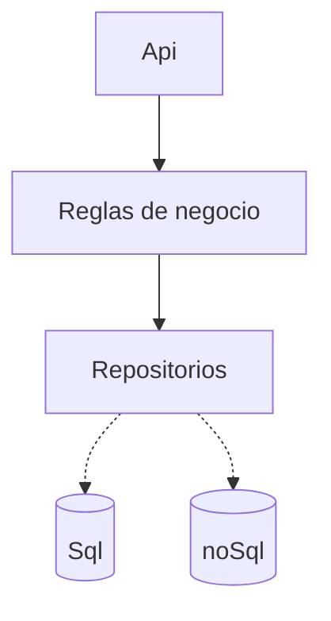
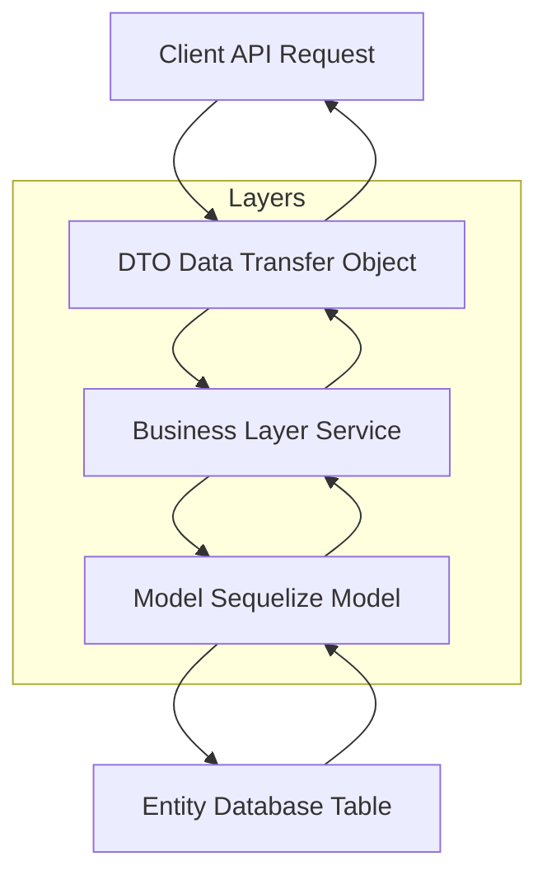

# Tareas

Un proyecto debe de estar dividido en las siguientes capas

El proyecto contendra más capas 


## Bussiness 
Donde estan todas la reglas de negocio, validaciones, consumo de servicios etc. Esta capa normalmente consume repositorios y modelos.

## Models
Son las clases o modelos, representación simplificada de la realidad la cual se pretende llegar o copiar.
El modelo es el mapeo con la tabla de la base de datos.

```classDiagram
class tarea{
    int Id
    string titulo
    string descripcion
    int usuarioId
    DateTime FechaDeRegistro
    bit estaActivo
}
```

###  tarea
| id  | titulo   | descripcion  | usuarioId   |estaActivo   |
|---|---|---|---|---|
|  1 | Hacer apuntes  | apuntes de nodejs  | 1  | 1  |
|  2 | Ejemplos  | Clases, diagramas y notas  | 1  | 1  |
|   |   |   |   |   |

/models/tarea.model.js
```js
class TareaModel{
    titulo
    descripcion
    usuarioId

    /**
     * 
     * @param {string} titulo 
     * @param {string} descripcion 
     * @param {int} usuarioId 
     */
    constructor(titulo, descripcion, usuarioId){
        this.titulo = titulo
        this.descripcion = descripcion
        this.usuarioId = usuarioId
    }
}
```

Tambien lo podemos encontrar como entidad

/entities/tarea.entity
/models/tarea.model.js
```js
class TareaEntity{
    titulo
    descripcion
    usuarioId

    /**
     * 
     * @param {string} titulo 
     * @param {string} descripcion 
     * @param {int} usuarioId 
     */
    constructor(titulo, descripcion, usuarioId){
        this.titulo = titulo
        this.descripcion = descripcion
        this.usuarioId = usuarioId
    }
}
```

# Repositorio
En nuestra carpeta de repositorios es la parte de la  app que se encarga de hacer la operaciones en la base de datos. 
Insertar, Actualizar, Borrar, Agregar, Buscar
El objeto que recibe el es modelo o entidad, que como se menciono anteriormente es el mapeo de la tabla

/repositorios/tarea.repositorio.js

```js
class TareaRepositorio {
    /**
   * 
   * @param {TareaModel} tarea    
   * @returns {int} id
   */
  static async agregarTarea(tarea) {
    const QUERY =
      "INSERT INTO tarea(id_uso, titulo, descripcion) VALUES (?, ?, ?)";
    const [result] = await pool.query(QUERY, [
      usuario.id,
      tarea.titulo,
      tarea.descripcion,
    ]);
    return result;
  }
}
```

Misma estructura pero con mongoDb
```js
class TareaRepositorio {
  /**
   *
   * @param {TareaModel} tarea
   * @returns {int} id
   */
  static async agregarTarea(tarea) {
    ahorro.id = await obtenerIdAsync();
    const db = await mongoDbConfig.conectarAMongoDb();
    let respuesta = await db.collection(coleccion).insertOne(ahorro);
    console.log(respuesta);

    return ahorro.id;
  }
}
```

# Routers
Es la capa que enlaza las rutas con el controlador.
En esta capa tambien se hace la evaluación de los datos de entrada y la verificación del inicio de sesión.

```js
const express = require("express");
const router = express.Router();

const { home_controller } = require("../controllers");
const { sesionActiva_middleware } = require("../middleware");

router.get("/", sesionActiva_middleware, home_controller.homeView);

module.exports = router;
```

# Controlador
Es la capa que manda a llamar el business o reglas de negocio, donde se porcesa la tarea y se manda la respuesta por medio de una respuesta api o una vista de mvc o redireccionamientos.

# Dto 
Es la clase que recibe y evalua los datos de entrada, verificando tipo y valores validos.